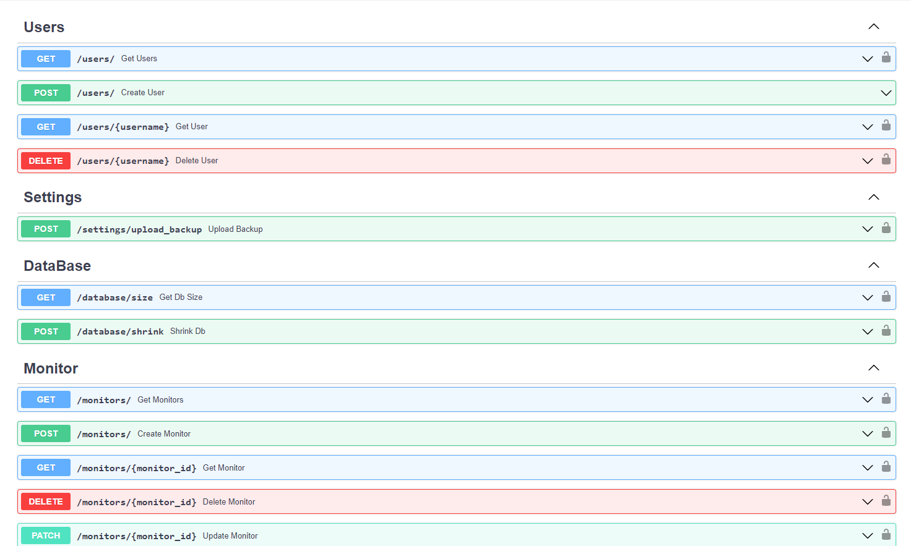
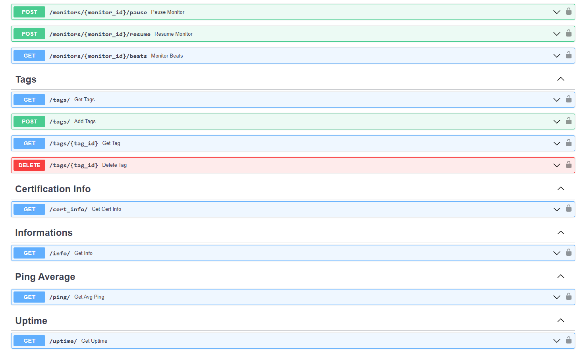

# Uptime-Kuma-Web-API

## API wrapper for Uptime-status-App

---

## EndPoints:

## How to use it:

---

### Environment Variables :

#### Required
You have to define these ENV VARS in order to connect to your KUMA server.

    KUMA_SERVER: The URL of your Uptime Kuma instance. ex: https://uptime.example.com
    KUMA_USERNAME: The username of your Uptime Kuma user
    KUMA_PASSWORD: The password of your Uptime Kuma user
    ADMIN_PASSWORD: An admin password to access the API

#### Optional
Additional configuration variables available

    ACCESS_TOKEN_EXPIRATION: Minutes the access token should be valid. Defaults to 8 days.
    SECRET_KEY: A secret value to encode JWTs with

#### Note:

You have to define your ADMIN_PASSWORD or you wont be able to connect to your rest api.

You will connect with those credentials:

    username = admin
    password = <ADMIN_PASSWORD>

### Features:

- Multi user Kuma api ( without privilege YET!!) with a small SQLite db
- Easy to use REST API with most of the Uptime-Kuma features
- Swagger Docs
- Multi-architecture support (amd64, arm64)
